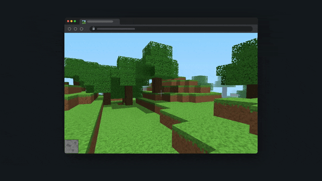
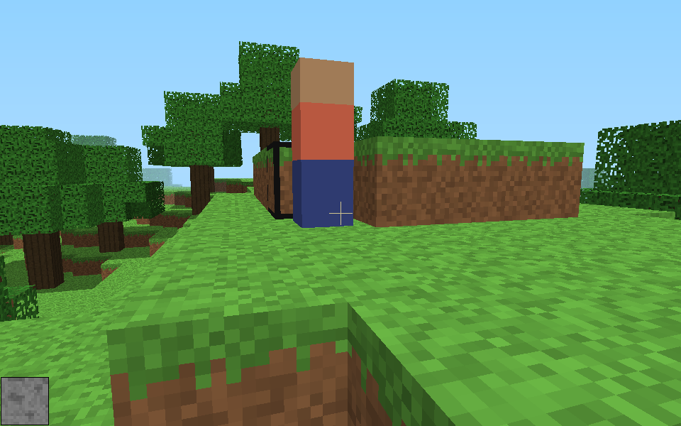
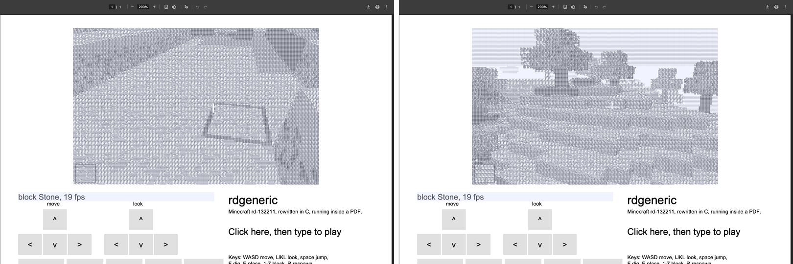
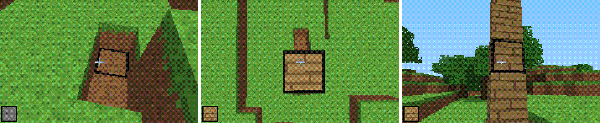
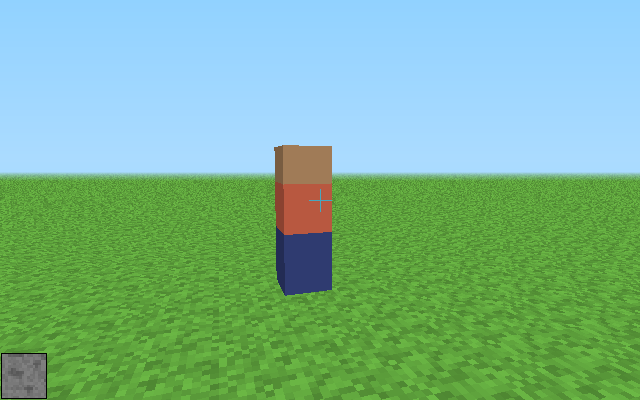

# rdgeneric



rdgeneric is Minecraft rd-132211, the first version Notch ever released (13 May 2009), rewritten as one freestanding C file so that it can be dropped onto any screen. The idea is the one behind [doomgeneric](https://github.com/ozkl/doomgeneric). The core has no includes, no libc calls and no allocation, so a new platform only has to hand it a framebuffer and some key presses.

The same `src/rd.c` currently runs in six places. It plays in a terminal, it serves a shared world over telnet, it runs in a browser as a 20 KB WebAssembly module, it runs inside a PDF in Chrome, and it boots on a bare x86 PC with no operating system. It also compiles for the Raspberry Pi Pico, the Pico 2 and the Game Boy Advance, though nothing has been run on that hardware yet.



## Where it runs

| Target | How the picture gets out | How input gets in | Checked how |
| --- | --- | --- | --- |
| Terminal | Upper half block characters, two pixels per cell, in truecolor, 256 colours or plain ASCII (the `m` key cycles them) | Keys, plus mouse look through SGR mouse reporting | Driven through a pseudo-terminal by a script |
| Telnet, multiplayer | The same, one view per connection, sized from each client's NAWS window report | Telnet in character mode | `tests/telnet_probe.py` rebuilds the screen a client receives |
| Browser | Canvas from a 20 KB wasm module built with plain clang, no Emscripten. The tab's favicon is a second live 32 by 32 view | Pointer lock or drag to look, touch controls on phones | Played in a Chromium pane, 341 by 256 renders in 7.8 ms |
| PDF | 120 text fields, one per row, filled with six character groups that share a width in Chrome's field font | A text field's keystroke action and on-page buttons | Headless Chromium, 8 to 19 fps |
| Bare-metal x86 | VGA mode 13h set by writing the card's registers, 6x6x6 colour cube with ordered dithering | PS/2 keyboard port, which reports key releases | QEMU with its 486, Pentium and qemu32 CPU models |
| Microcontrollers | Not written yet | Not written yet | Compiles only, see below |





The PDF works the way [DoomPDF](https://github.com/ading2210/doompdf) does, with one change of route. PDFium runs JavaScript but has no WebAssembly, and DoomPDF dealt with that by building with a 2020 Emscripten that could still emit asm.js. rdgeneric compiles the same C to wasm with clang, then converts the module to plain JavaScript with binaryen's `wasm2js`. The PDF itself is written by `tools/make_pdf.py` with no PDF library. I searched for an earlier Minecraft that runs inside a PDF and found none.

The embedded check below comes from `tools/mcu_check.sh`, which cross-compiles the core with a 32 by 24 by 32 world. RAM here is static data, which is the world, its light map and the generated textures. Apple's clang has no RISC-V backend, so the ESP32-C3 and the BL602 in smart bulbs are not in the table even though the code has nothing that would stop them.

| Target | Code | RAM |
| --- | --- | --- |
| RP2040, Cortex-M0+ (Pico) | 9.2 KB | 50 KB |
| RP2350, Cortex-M33 (Pico 2) | 9.1 KB | 50 KB |
| Game Boy Advance, ARM7TDMI | 9.3 KB | 50 KB |
| 386, no OS | 13.8 KB | 50 KB |

## Building

You need clang and Python 3. The web and PDF builds also need `wasm-ld` and `wasm2js`, and the boot test needs QEMU. On a Mac they all come from Homebrew.

```bash
brew install lld binaryen qemu
```

```bash
make
```

```bash
make test
```

`make` produces `rd-term`, `build/rdgeneric.html`, `build/rdgeneric.pdf` and `build/rdgeneric-x86.elf`. The HTML file has the wasm inlined, so it can be opened straight from disk.

```bash
./rd-term
```

```bash
./rd-term --serve 2323 --level world.dat
```

```bash
telnet localhost 2323
```

```bash
make run-x86
```

The terminal controls are WASD to move, the arrow keys or the mouse to look, space to jump, a click or F to dig, a right click or E to place, 1 to 7 to pick a block, R to respawn, M to change colour mode and Q to quit. In the PDF, click the input box first, then use WASD with IJKL to look. The x86 build also accepts IJKL and the arrow keys. To boot it on a real PC, load the ELF from GRUB with the `multiboot` command.

## Porting

A port is whatever calls these functions. Everything else in `src/rd.h` is optional. If your screen is not listed here, these five calls are the whole job.

```c
rd_init(seed, RD_HILLS);           /* or RD_FLAT for the rd-132211 level */
int me = rd_player_add();
rd_player_input(me, &input);       /* movement, turning, dig, place */
rd_tick();                         /* 60 times a second */
rd_render(me, pixels, w, h, w);    /* 0x00RRGGBB, any size */
```

The renderer casts one ray per pixel through the voxel grid, as Minecraft 4k did, so the cost depends only on the pixel count and the view distance. Nothing is precomputed per resolution, which is why the same call draws a 32 by 32 favicon and a 640 by 400 window. The world size is a compile-time setting. The default is rd-132211's 256 by 64 by 256 (4 MB) and small targets pass `-DRD_X=32 -DRD_Y=24 -DRD_Z=32`.

## The video

The clip at the top is one scripted walk, `src/rd_demo.c`, played on four platforms and cut together so the picture never jumps. The walk starts on a fixed seed and drives the same inputs on every tick. The world is generated in integer maths and every build turns off fused multiply-add (`-ffp-contract=off`), so each platform computes the same game state at every tick. On the 486 build, whose x87 unit keeps floats at 80 bits, the player position stays within a thousandth of a block of the native build for the whole walk.

Every frame in the clip was drawn by the platform shown. The browser frames come from the real page in headless Chromium, and the terminal frames are the bytes `rd-term` wrote to a pseudo-terminal, replayed in xterm.js. The PDF frames are screenshots of Chrome's own PDF viewer running the script, and the bare-metal frames are QEMU screendumps of VGA memory. The PDF and QEMU builds run at 5 to 19 fps in real time on this Mac, so the recorders step every platform one frame at a time and the clip plays them all at 30 fps. The browser window, the terminal window and the beige monitor around the picture are drawn by `tools/record/composite.py`. The PDF viewer around its picture is Chrome's own. A 720p copy is in [docs/rdgeneric.mp4](docs/rdgeneric.mp4).

```bash
make && tools/record/record_all.sh build/rec
```

The same walk is the easiest way to check a new port. Run it, step it two ticks at a time and compare the frames with the browser build.

## How close it is to rd-132211

These parts follow rd-132211's code as it appears in public decompilations. I wrote them from those descriptions and have not checked the constants against the original jar.

| Part | rd-132211 | rdgeneric |
| --- | --- | --- |
| Level | 256 x 256 x 64, solid to two thirds height, grass on top | The same with `RD_FLAT`. `RD_HILLS` adds terrain and trees |
| Timer | 60 ticks a second | The same |
| Movement | Acceleration 0.02 on the ground and 0.005 in the air, gravity 0.005, jump 0.12, drag 0.91 and ground friction 0.8 | The same |
| Collision | Clip y, then x, then z against every cube the move touches | The same |
| Light | A cell is lit when nothing solid is above it | The same, with shadowed faces at 0.6 |
| Face shading | 1.0 on top and bottom, 0.8 on z faces, 0.6 on x faces | The same |
| Sky | Clear colour 0.5, 0.8, 1.0 | The same, slightly paler near the horizon |

Some parts differ on purpose. The textures are generated by code and are not Mojang's terrain.png. There are seven block types where rd-132211 had two. Respawning puts the player on the surface, while rd-132211 dropped them from above the level. Other players appear as simple figures, which rd-132211 never needed because it had no multiplayer. The mouse buttons follow the modern convention. No Mojang code or assets are in this repository.



## Where Minecraft has run before

Minecraft has nothing like Doom's porting history. Doom's source has been public since 1997, while Minecraft's never was. Most "Minecraft on X" projects are therefore clones or ports of the tiny early versions. This is what I found while starting the project.

**Ports and translations of the early versions into C.** [beta-c](https://github.com/betacraftuk/beta-c) translates rd-132211 through Classic 0.0.12a. [RubyC](https://github.com/ilovecodingforsomereason/RubyC) is a C port of rd-132211. [MinecraftC](https://github.com/johnpayne-dev/MinecraftC) is a raytraced port of Classic 0.0.30a. [m4kc](https://github.com/sashakoshka/m4kc) decompiles Minecraft 4k into C with SDL, and [Minecraft4k-CPP](https://github.com/TheSunCat/Minecraft4k-CPP) reworks it for the GPU. [RDForward](https://github.com/martinambrus/RDForward) is a modding toolchain for rd-132211 with Android support, and someone has [ported rd-132211 to the 3DS](https://gbatemp.net/threads/release-rd-132211-old-minecraft-ported-to-the-3ds.680316/).

**ClassiCube**, the biggest effort of this kind. It is a Minecraft Classic client written from scratch in C, and its [repository](https://github.com/ClassiCube/ClassiCube) lists builds for the Switch, Wii, GameCube, Dreamcast, PS1, PS2, PS3, PSP, PS Vita, 3DS, DS, N64, Saturn, Xbox, Wii U, MS-DOS and Classic Mac OS, with very different levels of polish. For running a Minecraft-like game on old consoles it is already the doomgeneric of Minecraft.

**Calculators and handhelds.** On the TI-84 Plus CE there are [Blocks](https://github.com/TheScienceElf/Blocks-TI-84/) by TheScienceElf at about 10 fps, [MineCalc-CE](https://github.com/imatree247/MineCalc-CE) and [Minecraft-CE](https://github.com/TimmyTurner51/Minecraft-CE). An early project aimed at [Minecraft 1.3.2 on the TI-Nspire CX](https://github.com/Nickorama21/Minecraft--TI-Nspire-CX-Port). 3DSage made [GBACRAFT](https://archive.org/details/gbacraft) for the Game Boy Advance, and Game of Tobi got a [3D Minecraft running on the Game Boy Color](https://www.pcgamer.com/hardware/youtuber-gets-minecraft-running-on-an-original-game-boy-color-and-it-even-looks-kinda-playable/) and the original Game Boy.

**Microcontrollers and odd hardware.** [Picocraft](https://yohandev.github.io/portfolio/picocraft/) renders voxels on a Raspberry Pi Pico and an LCD, streaming chunks from a Spigot server. A minimal Minecraft server has run on an [ESP32-C3](https://hackaday.com/2025/09/13/esp32-hosts-functional-minecraft-server/) and on the [BL602 chip in a smart light bulb](https://www.tomshardware.com/maker-stem/microcontrollers/hardware-hacker-installs-minecraft-server-on-a-cheap-smart-lightbulb-single-192-mhz-risc-v-core-with-276kb-of-ram-enough-to-run-tiny-90k-byte-world), with 276 KB of RAM. Both of those run a server and draw nothing. The real game has been shown on a [Tektronix oscilloscope](https://www.youtube.com/watch?v=yIRZrKriqqc) through a VGA to XY adapter, and on a [GPU with 8 MB of video memory](https://tech.yahoo.com/gaming/articles/minecraft-runs-8mb-vram-using-144600508.html).

**Bare metal, terminals and Minecraft itself.** [MineAssemble](https://github.com/Overv/MineAssemble) is a bootable Minecraft clone written partly in x86 assembly, so rdgeneric's x86 build is not the first to boot without an OS. [TermCraft](https://github.com/woliver99/termcraft) is a terminal Minecraft in Rust that uses the same half-block trick and has LAN multiplayer, and [terminal-minecraft](https://github.com/PedroDNBR/terminal-minecraft) does it in C++ for Windows Terminal. Minecraft has also run [inside Minecraft on the CHUNGUS 2 redstone computer](https://hackaday.com/2023/05/27/minecraft-in-minecraft-on-the-chungus-ii/).

## Limitations

None of these is hidden in the code, and each is worth knowing before you build on it.

- No microcontroller port draws anything yet. The table above shows that the core compiles and fits, and it says nothing about frame rate on a 133 MHz Cortex-M0+ with no FPU, where every float is done in software.
- The x86 build has only run in QEMU. On an Apple Silicon Mac, QEMU emulates every x86 instruction, which gives 5 to 10 fps on the 486 model and about 9 fps on qemu32. Real hardware should be faster, but that has not been measured.
- Most terminals never report key releases, so a key counts as held for 0.6 s after the first press and 0.12 s after each repeat. Movement keeps going briefly after you let go. Terminals that speak the kitty keyboard protocol report releases, and rd-term switches to exact timing when it sees that support. The status line says which mode is in use.
- The PDF needs a Chromium browser. Firefox, Preview and Acrobat do not run its script. It renders in six shades of grey at 8 to 19 fps.
- The telnet server sends a full colour frame per client, at up to 30 fps, with only changed cells redrawn. That is fine on a LAN and heavy over a slow link, where 256-colour mode (the `m` key) helps.
- Saving exists only in the terminal build (`--level`), as raw blocks. rd-132211 gzipped its `level.dat`.

## Layout

```
src/rd.h, src/rd.c        the core
platforms/term/           terminal and telnet server
platforms/web/            wasm glue and the HTML page
platforms/pdf/            the script that runs inside the PDF
platforms/baremetal/      Multiboot kernel for x86
tools/                    PDF writer, wasm inliner, snapshot renderer, embedded size check
tests/run.sh              builds everything and checks each target
```
